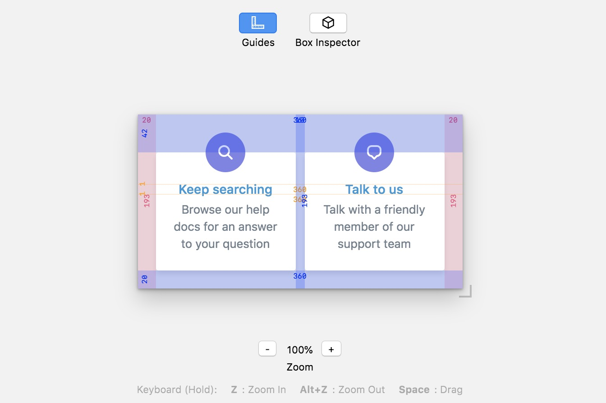

# 🖼 Artboard

[](https://travis-ci.org/helpscout/artboard)
[](https://badge.fury.io/js/%40helpscout%2Fartboard)

> A tool kit for React UI development and design



## Table of contents

<!-- START doctoc generated TOC please keep comment here to allow auto update -->
<!-- DON'T EDIT THIS SECTION, INSTEAD RE-RUN doctoc TO UPDATE -->

- [Installation](#installation)
- [Usage](#usage)

<!-- END doctoc generated TOC please keep comment here to allow auto update -->

Project is still under development!

## Installation

```text
npm install --save-dev @helpscout/artboard
```

## Usage

Here's an example Storybook story with Artboard!

```jsx
import React from 'react'
import Artboard from '@helpscout/artboard'
import MyComponent from './MyComponent'

const stories = storiesOf('MyComponent', module)

stories.add('Example', () => (
  <Artboard>
    <MyComponent />
  </Artboard>
))
```
